# 📱 Ekosistem Digital Telkomsel Halo Hub

> **Cetak Biru Strategis & Diagram Ekosistem Digital**: Menyatukan halaman Telkomsel Halo yang terfragmentasi ke dalam model **2-Page Hub-and-Spoke**, fast-track aktivasi **eSIM 5G**, serta solusi presisi **Pre-to-Post (Halo Optima ARPU Uplift)**.

---

## 🌐 Akses Visual Interaktif (Web Presentation)
Buka link di bawah ini untuk melihat dan mendemonstrasikan peta ekosistem interaktif langsung di peramban:  
👉 **[https://davalasafawork-cmyk.github.io/telkomsel-halo-ecosystem/](https://davalasafawork-cmyk.github.io/telkomsel-halo-ecosystem/)**

*(Di halaman tersebut, Anda bisa mengeklik tombol **⚡ Pasang Baru (eSIM 5G)** atau **🔄 Pre-to-Post (Optima)** untuk menyorot alur spesifik saat presentasi).*

---

## 🗺️ Graph Diagram Ekosistem Halo Hub

Diagram alur di bawah ini dirender langsung oleh GitHub untuk memetakan orkestrasi seluruh touchpoint:

```mermaid
flowchart LR
    %% STYLING
    classDef traffic fill:#F8FAFC,stroke:#94A3B8,stroke-width:1.5px,color:#0F172A;
    classDef hub fill:#FFE4E6,stroke:#E11D48,stroke-width:2px,color:#9F1239,font-weight:bold;
    classDef newPath fill:#EFF6FF,stroke:#3B82F6,stroke-width:1.5px,color:#1E40AF;
    classDef p2pPath fill:#ECFDF5,stroke:#10B981,stroke-width:1.5px,color:#065F46;
    classDef core fill:#F3E8FF,stroke:#A855F7,stroke-width:1.5px,color:#6B21A8;
    classDef retention fill:#FFFFFF,stroke:#64748B,stroke-width:1.5px,color:#334155;

    %% 1. INGESTION
    subgraph S1["1. TRAFIK INGESTION"]
        direction TB
        ADS["Paid Ads (Meta/Google 5G)"]:::traffic
        SEO["Organik / telkomsel.com"]:::traffic
        CRM["SMS / WA / MyT Push (P2P)"]:::traffic
    end

    %% 2. SHOWCASE HUB
    subgraph S2["2. SHOWCASE HUB"]
        P1["telkomsel.com/halo
        • Benefit 5G Prioritas & Roaming
        • 3 Pilar: Kontrak / Optima / Flexy
        • Fast-Track eSIM Hook"]:::hub
    end

    %% 3. INTENT SPLIT
    subgraph S3["3. CONVERSION ENGINE"]
        direction TB
        NEW_FLOW["[Jalur Pasang Baru]
        • Akses Semua Pilar & Tier
        • Pilih Nomor Acak / Cantik
        • Format: eSIM 5G vs Fisik"]:::newPath
        
        P2P_FLOW["[Jalur Pindah ke Halo]
        • Kunci Eksklusif: Halo Optima
        • Smart ARPU Gatekeeper
        • Render Paket >= Historical ARPU"]:::p2pPath
    end

    %% 4. CHECKOUT
    subgraph S4["4. WEB CHECKOUT & CORE"]
        direction TB
        WEB_KYC["In-Browser Dukcapil KYC
        + Instant Payment (QRIS/VA)"]:::core
        
        PROV_ESIM["eSIM 5G: Render QR di Web (<2 Mnt)"]:::core
        PROV_OTA["P2P: Switch Profil Jaringan Otomatis (OTA)"]:::core
    end

    %% 5. RETENTION
    subgraph S5["5. RETENSI & SAFETY"]
        direction TB
        APP["MyTelkomsel App
        Billing, Cek Kuota, & Poin"]:::retention
        WA_BOT["Veronika WhatsApp
        Cart Recovery (<15 Mnt)"]:::retention
    end

    %% FLOW CONNECTIONS
    ADS --> P1
    SEO --> P1
    CRM -->|Tokenized Magic Link| P2P_FLOW

    P1 -->|Pilih Pasang Baru| NEW_FLOW
    P1 -->|Pilih Pindah Nomor Lama| P2P_FLOW

    NEW_FLOW --> WEB_KYC
    P2P_FLOW --> WEB_KYC

    WEB_KYC --> PROV_ESIM
    WEB_KYC --> PROV_OTA

    PROV_ESIM --> APP
    PROV_OTA --> APP
    WEB_KYC -.->|Drop-off / Pending| WA_BOT
```

---

## 📑 Daftar Deliverables Proyek

| File | Format | Deskripsi & Akses Cepat |
| :--- | :--- | :--- |
| **[`index.html`](index.html)** | Interactive App | Visualisasi ekosistem interaktif yang di-host di [GitHub Pages](https://davalasafawork-cmyk.github.io/telkomsel-halo-ecosystem/). |
| **[`ekosistem_halo_hub.html`](ekosistem_halo_hub.html)** | Standalone Widget | Versi widget visual diagram ekosistem mandiri. |
| **[`blueprint_redesign_telkomsel_halo.pptx`](blueprint_redesign_telkomsel_halo.pptx)** | PowerPoint 16:9 | Slide deck 7 halaman gaya eksekutif McKinsey untuk presentasi ke level GM / VP. |
| **[`blueprint_redesign_telkomsel_halo.pdf`](blueprint_redesign_telkomsel_halo.pdf)** | Executive PDF | Dokumen blueprint lengkap format A4 siap cetak & baca offline. |
| **[`blueprint_redesign_telkomsel_halo.md`](blueprint_redesign_telkomsel_halo.md)** | Technical Spec | Dokumentasi detail arsitektur informasi, payload API, dan spesifikasi tim web developer. |

---

## 💡 Ringkasan 3 Pilar Produk Telkomsel Halo
1. **📱 Halo Kontrak**: Komitmen jangka panjang 12–24 bulan untuk bundling smartphone flagship (iPhone/Galaxy) dengan diskon paket hingga 40%. *(Eksklusif Pasang Baru)*.
2. **👑 Halo Optima (Reguler)**: Pascabayar murni dengan kuota besar 24 jam tanpa bagi jam, bebas roaming di 100+ negara, dan Disney+ Hotstar. *(Tersedia untuk Pasang Baru & Pre-to-Post)*.
3. **⚖️ Halo Flexy**: Pascabayar fleksibel dengan batas kontrol tagihan (*Credit Limit Control*) ketat untuk mencegah *bill shock*. *(Eksklusif Pasang Baru)*.

---

## 👥 Authors
* **Inisiatif**: Redesign & Orkestrasi Touchpoint Digital Telkomsel Halo
* **Repositori Resmi**: [github.com/davalasafawork-cmyk/telkomsel-halo-ecosystem](https://github.com/davalasafawork-cmyk/telkomsel-halo-ecosystem)
