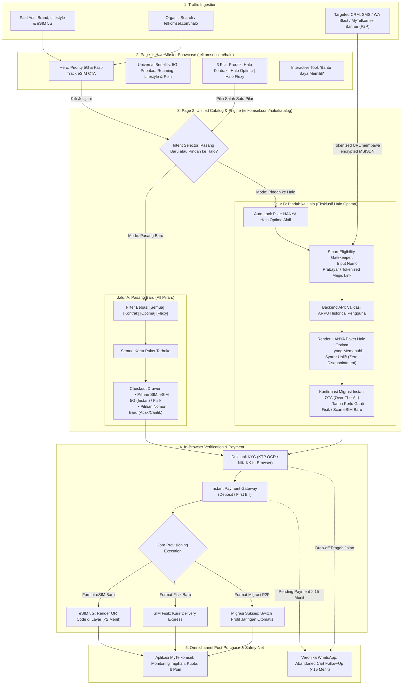

# Blueprint Redesign & Orkestrasi Touchpoint Digital: Telkomsel Halo
## Model 2-Page Hub-and-Spoke & Skema Terintegrasi Pre-to-Post (P2P)

Dokumen ini merupakan cetak biru (*blueprint*) komprehensif arsitektur digital **Telkomsel Halo** di web portal (`telkomsel.com/halo`). Dokumen ini mengintegrasikan dua skema utama:
1. **Akuisisi Pasang Baru (New Acquisition)**: Menjangkau seluruh lini produk (*Halo Kontrak*, *Halo Optima*, *Halo Flexy*) dengan opsi aktivasi instan **eSIM 5G**.
2. **Migrasi Prabayar ke Pascabayar (Pre-to-Post / P2P)**: Penanganan khusus pelanggan nomor lama prabayar dengan aturan bisnis **ARPU Uplift**, yang secara eksklusif dialokasikan untuk lini **Halo Optima** menggunakan prinsip *"Identify-First, Reveal-Second"* demi mencegah kekecewaan pelanggan (*customer frustration*).

---

## 1. Problem Statement & Solusi Arsitektur

### Tantangan Eksisting:
* **Fragmentasi Halaman**: Halaman *Halo+*, *Pindah ke Halo*, *Halo Family*, dan *Device Plan* berdiri sendiri-sendiri, memicu kanibalisasi *traffic* dan kebingungan pengguna.
* **Jebakan UX Pre-to-Post (ARPU Uplift Conflict)**: Aturan bisnis telko mewajibkan paket pascabayar migrasi memiliki nilai $\ge$ rata-rata pemakaian (*historical ARPU*) prabayar pengguna untuk mencegah *ARPU dilution*. Jika katalog paket dibuka bebas sejak awal, pengguna ber-ARPU tinggi yang memilih paket murah akan ditolak di akhir alur (*false expectation & feeling penalized*).
* **Solusi Web-First**: Mengoptimalkan keunggulan tim `telkomsel.com` yang memiliki siklus *deployment* lebih cepat dan kapabilitas kustomisasi dinamis tinggi untuk memfilter katalog secara *real-time*.

---

## 2. Diagram Alur Funnel Terpadu (Pasang Baru & Pre-to-Post)

Diagram alir berikut memetakan bagaimana dua kelompok audiens (Pasang Baru vs Migrasi Pre-to-Post) diarahkan secara presisi:



---

## 3. Detail Arsitektur Halaman & Wireframe

### A. Page 1: Halo Master Showcase Hub (`telkomsel.com/halo`)
*Tujuan: Membangun preferensi brand, mengedukasi nilai tambah pascabayar, dan mengarahkan pengguna ke kategori paket yang tepat.*

* **Hero Section**:
  * Headline: *"Beralih ke Telkomsel Halo: Layanan Prioritas 5G Terbaik Tanpa Khawatir Kehabisan Pulsa."*
  * Fast-Track Strip: *"Miliki HP 5G? Dapatkan eSIM Aktif dalam 2 Menit ⚡"*
  * CTA: `[Pilih Paket Halo]` $\rightarrow$ *Instant transition* ke Page 2.
* **Universal Benefits Showcase (Layer 1)**:
  1. *Priority Network 5G*: Bandwidth prioritas di area ramai.
  2. *Global Roaming Ready*: Bebas roaming otomatis di 100+ negara.
  3. *Lifestyle & Entertainment*: Bundling Disney+ Hotstar, Prime Video, dan penukaran Telkomsel Poin.
  4. *Zero Bill Shock*: Fitur batas kontrol pemakaian (*Credit Limit Control*).
* **3-Pilar Lini Produk Showcase**:
  * **Halo Kontrak**: Komitmen hemat dengan bundling HP flagship (iPhone/Galaxy) atau diskon tagihan hingga 40%.
  * **Halo Optima**: Layanan pascabayar reguler kuota masif, bebas roaming, dan hiburan premium (tersedia untuk Pasang Baru & Migrasi Nomor Lama).
  * **Halo Flexy**: Pascabayar fleksibel dengan kontrol pagu biaya bulanan yang ketat (eksklusif Pasang Baru).
* **Interactive Tool ("Bantu Saya Memilih")**:
  * Kuis 3 pertanyaan rekomendasi otomatis yang mengarahkan langsung ke URL Page 2 dengan *pre-set filter*.

---

### B. Page 2: Unified Catalog & Conversion Engine (`telkomsel.com/halo/katalog`)
*Tujuan: Menjadi mesin filter pintar dan transaksi instan tanpa reload halaman.*

#### 1. Header Dual-Track Intent Switcher
Di bagian paling atas halaman terdapat *toggle switch* penentu alur:
```
┌────────────────────────────────────────────────────────────────────────┐
│ BAGAIMANA ANDA INGIN BERLANGGANAN HALO?                                │
│ [● Pasang Nomor Baru]        [○ Pindah ke Halo (Gunakan Nomor Lama)]  │
└────────────────────────────────────────────────────────────────────────┘
```

#### 2. Kondisi State: Jika Memilih "Pasang Nomor Baru"
* **Filter Pilar Terbuka**: Tab `[Semua] [Halo Kontrak] [Halo Optima] [Halo Flexy]`.
* **Katalog Menampilkan Seluruh Tier**: Dari tier entri hingga flagship.
* **Drawer Checkout**:
  * Pilihan Format: **eSIM 5G (Instan)** vs **SIM Fisik**.
  * Pemilihan Nomor: Pilihan nomor gratis atau pencarian 4 digit nomor cantik.
  * Form KYC Dukcapil & Pembayaran instan.

#### 3. Kondisi State: Jika Memilih "Pindah ke Halo" (Pre-to-Post)
* **Kunci Otomatis ke Pilar Halo Optima**: Tab *Halo Kontrak* dan *Halo Flexy* dinonaktifkan dengan badge transparan: *"Migrasi nomor lama saat ini eksklusif untuk Halo Optima."*
* **Smart Eligibility Gatekeeper (Identify-First)**:
  Sebelum daftar kartu paket ditampilkan, muncul modul verifikasi nomor:
  ```
  ┌──────────────────────────────────────────────────────────────────────┐
  │ 🔄 Cek Paket Halo Optima yang Sesuai untuk Nomor Anda                 │
  │ Masukkan nomor Telkomsel prabayar Anda untuk melihat penawaran       │
  │ prioritas yang telah dipersonalisasi:                                │
  │                                                                      │
  │ [ 0812-xxxx-xxxx          ] [ Lihat Paket Saya ➔ ]                   │
  │ 🔒 Data Anda terlindungi. Verifikasi cepat dikirim via SMS/OTP.       │
  └──────────────────────────────────────────────────────────────────────┘
  ```
* **Katalog Terkurasi Sisi Server (Zero Disappointment)**:
  * Backend API menghitung rata-rata pengeluaran bulanan (ARPU) nomor tersebut.
  * Web **hanya me-render kartu paket Halo Optima yang $\ge$ nilai ARPU**.
  * **Pemberian Label Positif**:
    * Paket terendah yang *eligible* diberi pita: 🏷️ *[Paling Sesuai Konsumsi Anda]*.
    * Paket di atasnya diberi pita: 🏷️ *[Rekomendasi Upgrade Kuota Maksimal]*.
  * Pelanggan tidak pernah melihat paket di bawah batas ARPU-nya, sehingga **ekspektasi palsu tidak pernah terjadi**.
* **Frictionless OTA Checkout**:
  * Pelanggan tidak perlu memilih nomor baru atau menunggu kurir SIM fisik.
  * Profil SIM prabayar eksisting otomatis di-upgrade ke pascabayar secara *Over-The-Air (OTA)* begitu validasi NIK dan pembayaran deposit disetujui.

---

## 4. Matriks Orkestrasi Touchpoint Digital

| Touchpoint Digital | Peranan Spesifik | Skenario Pasang Baru | Skenario Pre-to-Post (P2P) |
| :--- | :--- | :--- | :--- |
| **Page 1 (Showcase Hub)** | Edukasi & Penyaring Intent | Menerima traffic Google Ads & organik, mengedukasi benefit 5G. | Mengedukasi pelanggan prabayar keuntungan pindah ke Halo Optima. |
| **Page 2 (Catalog Engine)** | Mesin Konversi Utama | Menampilkan seluruh pilar, nomor cantik, dan penerbitan eSIM 5G. | Gatekeeper validasi ARPU, render paket terkurasi, migrasi OTA. |
| **Aplikasi MyTelkomsel** | Sumber Trafik P2P & Retensi | Mengarahkan user baru untuk cek kuota dan tagihan bulanan. | Menampilkan *in-app banner* promo P2P dengan *Magic Link* ke Page 2. |
| **WhatsApp Veronika** | Safety-Net & Abandoned Cart | Mengirimkan salinan QR Code eSIM dan recovery pembayaran tertunda. | Mengirimkan reminder aktivasi jika proses input NIK terhenti di web. |
| **SMS / WA Push Campaign** | P2P Dedicated Acquisition | - | Mengirimkan pesan penawaran upgrade berisi *Tokenized Magic Link*. |

---

## 5. Spesifikasi Teknis untuk Tim Web Developer (`telkomsel.com`)

1. **Tokenized Magic Link Handling (P2P Seamless Ingestion)**:
   * URL format: `telkomsel.com/halo/katalog?mode=migrate&token=eyJhbGciOi...`
   * Saat mendeteksi parameter token yang valid (dari blast SMS/WA/MyTelkomsel), aplikasi web otomatis:
     1. Mengaktifkan tab *Pindah ke Halo*.
     2. Men-decode identitas nomor terenkripsi tanpa meminta user mengetikkan nomor ulang.
     3. Langsung memanggil API ARPU dan me-render kartu paket yang *eligible*.
2. **API Eligibility & ARPU Uplift Engine**:
   * Endpoint: `POST /api/v1/halo/p2p/eligibility`
   * Payload: `{ msisdn: string, otpToken: string }`
   * Response:
     ```json
     {
       "status": "ELIGIBLE",
       "tier_level": "TIER_2",
       "min_package_price": 150000,
       "recommended_packages": [
         { "id": "HO-150K", "name": "Halo Optima 150K", "is_best_fit": true },
         { "id": "HO-250K", "name": "Halo Optima 250K", "is_upgrade": true }
       ]
     }
     ```
3. **In-Browser WebRTC KTP OCR & Dukcapil Validation**:
   * Pengambilan foto KTP langsung via kamera peramban untuk membaca NIK secara otomatis, mengurangi *drop-off* akibat kesalahan input manual.
4. **Client-Side SPA Architecture (Next.js)**:
   * Perpindahan antara Page 1 dan Page 2 menggunakan *client-side routing* dengan persistensi *state*, menghadirkan pengalaman secepat aplikasi tanpa jeda *loading* browser.
5. **Direct SM-DP+ & OTA Provisioning Integration**:
   * Untuk Pasang Baru eSIM: Menampilkan QR Code profil eSIM langsung di halaman konfirmasi web, didukung tombol *“Unduh Panduan PDF”* dan *“Kirim ke WhatsApp”*.
   * Untuk Pre-to-Post: Mengirim sinyal aktivasi langsung ke core provisioning Telkomsel agar status pascabayar aktif seketika tanpa perlu ganti kartu SIM.
